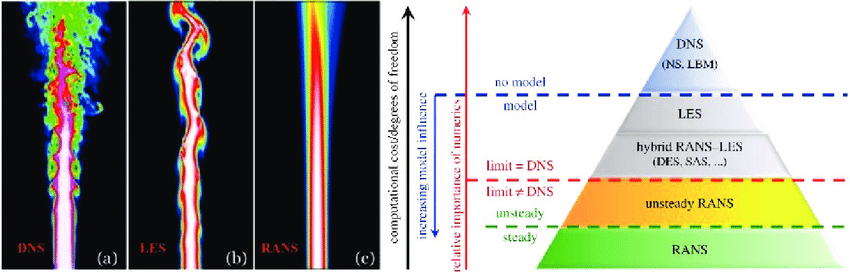

# CFD 

## Principy modelování
*CFD = Computational Fluid Dynamics*
- řešení diferenciálních rovnic (ZZ hmoty - rovnice kontinuity, hybnosti - Navier-Stokesovy rovnice, energie)

Obecně výpočet probíhá ve 2 krocích:
1. Diskretizace definičního oboru ({math}`\vec{x}, t`)
    - různé metody (FVM, FEM, ...)
2. Iterační řešení systému algebraických rovnic

## Postup
1. Pre-processing
    - definice geometrie
    - generace výpočetní sítě (mesh) - prostorová, časová
    - volba modelů (turbulence, fyzikální a chemické procesy,...)
        - záleží na požadované přesnosti (a dostupném hardwaru)
        - další faktory - počt fází, přenos energie,...
    - termofyzikální vlastnosti materiálů (hustota, viskozita,...)
        - zadané jako konstanty, tabulka hodnot nebo funkce
    - hraniční (popř. i počáteční) podmínky
        - vstup, výstup, stěny,...
        - v případě nestacionárních úloh se často používá řešení stacionární úlohy jako počáteční podmínka
2. Výpočet
    - nejsnažší část - pracuje počítač
    - vyplatí se sledovat konvergenci -- např. zkontrolovat, že residua klesají
3. Post-processing
    - kontrola, že výsledky dávají smysl
    - analýza konvergence
        - zkontrolovat, že další iterace už nemění výsledek
        - ověřit vliv sítě (meshe) na výsledek
            - provést výpočet na jemnějším meshi a porovnat výsledky
    - zpracování výsledků do požadovaného formátu


## Chyby
1. **Numerické**
    1. Diskretizační

    Souvisí s náhradou derivace diferenčním schématem:
    ```{math}
    \frac{\partial u}{\partial x} &\approx \frac{u(x+h) - u(x)}{h} + \mathcal{O}(h) \\
    \frac{\partial u}{\partial x} &\approx \frac{u(x) - u(x-h)}{h} + \mathcal{O}(h) \\
    \frac{\partial u}{\partial x} &\approx \frac{u(x+0.5h) - u(x-0.5h)}{h} + \mathcal{O}(h^2)
    ```

    Odhad velikosti diskretizační chyby -- porovnat výpočty na různých sítích.

    2. Zaokrouhlovací

       Souvisí s reprezentací reálných čísel v počítači (`float`, `double`). 

       Diskretizační a zaokrouhlovací chyby jdou proti sobě:
       - snížení diskretizační chyby vede k většímu počtu výpočtů, což může vést k větší zaokrouhlovací chybě (záleží však na typu úlohy, stabilitě schématu,...)

    3. Chyba konvergence
    - výpočet různých veličin (rychlosti, teploty,...) konverguje různě rychle 
    - pro kontrolu stačí sledovat např. velikost residua v závislosti na iteraci
    - souvisí s iteračním schématem (typem a hyperparametry) pro řešení maticové úlohy

    4. Chyba diskretizace fyzikálního modelu
    - souvisí se zadáním a modelovacími chybami
    - TODO

2. **Modelovací**
    1. Příliš zjednodušená geometrie
    - např. špatné použití symetrie nebo zanedbání malé oblasti
    2. Fyzikální modely
    - souvisí s modelováním fyzikálních procesů
    - např. volba modelu turbulence
        - RANS je rychlé, ale dělá značná zjednodušení
        - LES řeší některé struktury v proudění, malé struktury pak modeluje; více náročné na HW než RANS, méně než LES
        - DNS řeší přímo Navier-Stokesovy rovnice, ale je vysoce náročné na HW

        |  |
        |:--:|
        | Vlevo: Srovnání DNS (a), LES (b) a RANS (c) simulace proudění z trysky (Italian Agency For New Energy Technologies 2006). Vpravo: Schematické znázornění rozdílu mezi RANS, LES and DNS modelováním (Deck et al. 2014). Převzato z ResearchGate, příspěvek uživatele Alwin Hopf, přeloženo. Originál viz https://www.researchgate.net/figure/Left-Comparison-of-a-DNS-a-LES-b-and-RANS-c-simulation-of-a-jet-flow-Italian_fig1_330765625 |

       - stlačitelnost tekutin -- často se aproximují jako nestlačitelné - ale to není použitelné vždy
       - potřeba předem odhadnout, co je použitelné (např. {math}`v \ll c`, kde {math}`c` je rychlost zvuku, pak aproximace nestlačitelné tekutiny lze použít)

    3. Termofyzikální vlastnosti
    - často aproximujeme konstantami, ale někdy je potřeba poskytnout závislost {math}`x(\rho)` nebo {math}`x(T)` 
    - např. přirozená konvekce

    4. Hraniční podmínky
    5. Počáteční podmínky
    6. Uživatelské funkce
    7. Fázové přechody


## Tvorba geometrie
2 možnosti:

1. Import modelu z CAD (např. `stl` formát)
  - často zdroj chyb -- model se nenaimportuje správně,...
2. Vlastní SW pro tvorbu geometrie v CFD programu
  - Odstraňuje problém s importem
  - Modelovací prostředí nemusí nabízet funkcionalitu jako samostatný CAD software
  - 2 přístupy k implementaci
    - centrální - 1 prostředí, kde se pracuje pořád (např. Geostar)
    - samostatné moduly - typické u velkých balíků (např. Ansys)

### Přístupy ke geometrii
1. CLI (*command line interface*) + náhled 
  - expert-friendly
2. myš + ikony
  1. od nejmenších modelů
    - křivky -> plochy -> objemy
    - nejdřív geometrie, pak síť
  2. od sítě 
    - deformace apod.
    - typické pro starší SW


## Diskretizace geometrie
- v CFD může mít velký vliv na výsledek (v pevnostních výpočtech spíš menší)

### Prvky 
- dle dimenzionality:
  - 1D
      - úsečka / křivka
      - obsahuje >= 2 nody (2 - úsečka, 3 - quadratic curve, 4 - cubic curve)
  - 2D
      - trojúhelníky (>= 3 nody), čtyřhrany (>= 4 nody)
      - strana může být křivá (pak potřebuje > 2 nody)
  - 3D 
      - hexahedron - 6 stěn, >= 8 nodů, nemusí být pravoúhlý
      - hranol (prism)
      - pyramid
      - tetrahedron
      - dodecahedron
      - polyhedra - libovolný tvar (mnohostěn)


### Požadavky na síť
- pokrýt celý objem
- prvky se nesmí překrývat
  - výjimka - síť typu "chiméra" - překryv je úmyslný


### Typy sítí
1. Strukturované = pravidelné
    - typ H - každý nód obklopen stejným množstvím prvků
    - typ O - okolo kruhových těles - radiální
    - typ C - kulaté + ostrý bod - např. křídla
    - obecně jednodušší na výpočet - vede na řešení úlohy s pásovou maticí

2. Nestrukturované = nepravidelné
    - složitější (horší indexování kvůli nepravidelnostem) -> náročnější
    - dnes preferováno -- dává elementy tam, kde je potřeba lepší rozlišení (oblasti s ostrými gradienty)

- při použití několika různých sítí je potřeba řešit napojení
  - konformní - sítě se napojují
  - nekonformní - nody nesousedí
  - rozhraní 2 sítí může být zdrojem chyb


- Speciální
  - rotující mříže -- pro čerpadla a jiné pohyblivé části
   - dynamické -- pohybuje se
  - dynamic refinement -- zhušťuje se podle potřeby
    - problém -- jak správně zvolit kritérium pro zhuštění
    - použití např. pro dvoufázové proudění -- zjemnění sítě poblíž fázového rozhraní


### Posuzování kvality sítě
1. hustota sítě
  - balancování HW náročnosti proti přesnosti
  - doporučuje se provést výpočet na 2 různě hustých sítích a sledovat konvergenci hodnot

2. parametry prvků
  1. poměr stran
    - optimálně blízko 1 (tj. prvky nejsou příliš roztáhnuté v 1 dimenzi
    - výjimka - prismatické prvky pro rozlišení mezní vrstvy
  2. šikmost (skewness) - zkosení
  3. ortogonalita
